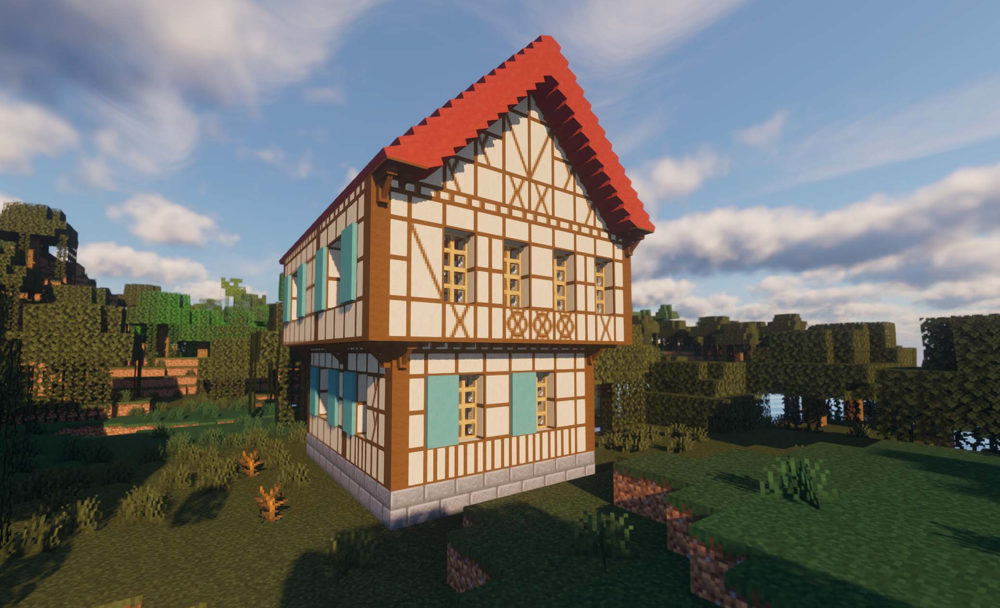

# Franconian Timber Frame Mod for Minecraft 1.19 #

The Franconian Timber Frame Mod is a Minecraft modification that adds a new set of decorative blocks to the game inspired by the traditional Franconian half-timbered style architecture.

# Features #

The mod includes the following features:

Franconian timber frame blocks: A set of decorative blocks inspired by the traditional half-timbered style architecture found in the Franconia region of Germany. The blocks are designed to be used in building structures such as houses, barns, and sheds.
Multiple block variations: The mod includes several different variations of the timber frame blocks, including plain, cross, and diagonal patterns. This allows for a greater level of customization when building structures.
Compatibility: The mod is designed to be compatible with other Minecraft mods and can be used in combination with them.
Easy installation: The mod is easy to install and can be added to Minecraft quickly and easily.

# Installation #

To install the Franconian Timber Frame Mod, follow these steps:

1.    Download and install Minecraft Forge for the version of Minecraft you are using.
1.    Download the Franconian Timber Frame Mod from a trusted mod repository.
1.    Move the downloaded .jar file into your Minecraft mods folder.
1.    Launch Minecraft and the mod should now be installed and ready to use.

# Usage #

To use the Franconian Timber Frame blocks, simply craft them like any other Minecraft block and place them in your structure. Use different variations of the blocks to create unique patterns and designs.

# Conclusion #

If you're looking to add some unique and decorative blocks to your Minecraft builds, the Franconian Timber Frame Mod is a great choice. With its multiple block variations and compatibility with other mods, you'll be able to create beautiful and unique structures in no time.

# Translating #

If you would like to help translate TimberFrameMode, you can do so.

# Credits #

This mod was created by LordHaHaHa and is based on the traditional half-timbered style architecture found in the Franconia region of Germany.

* LordHaHaHa
* nicetiger
